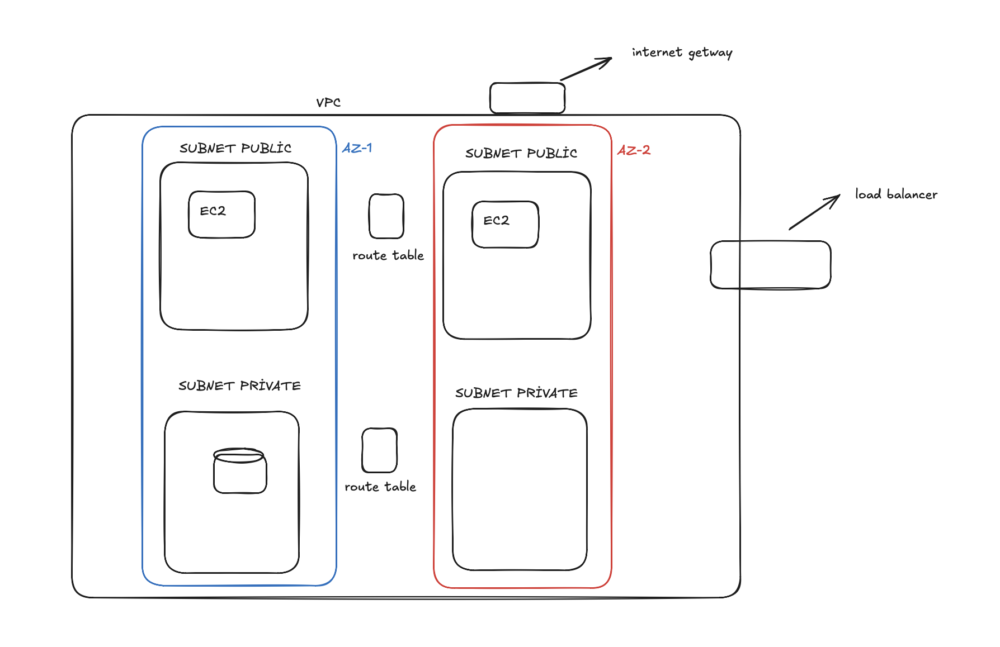

Bu proje, bir web servisinin production benzeri koşullarda AWS üzerinde nasıl tasarlanıp, güvenli bir ağ mimarisiyle yayına alınıp, ölçeklenebilir ve otomatik dağıtılabilir hale getirileceğini uçtan uca deneyimlemek amacıyla geliştirilmiştir. Odak noktası uygulama kodu değil, **altyapı tasarımı, ağ güvenliği, yük dengeleme ve CI/CD otomasyonu** olmuştur.
 
Proje kapsamında iki farklı Availability Zone'a yayılmış bir VPC kuruldu; her AZ'de public ve private subnet ayrımı yapılarak internete açık bileşenler (EC2, Load Balancer) ile veritabanı (RDS) birbirinden izole edildi. Security Group'lar en az yetki prensibiyle yapılandırılarak sadece gerekli servisler arasında iletişime izin verildi (örneğin RDS yalnızca EC2'lerin bağlı olduğu security group'tan gelen PostgreSQL trafiğini kabul ediyor). Trafik dağıtımı için bir Application Load Balancer ve Target Group kuruldu; her iki AZ'deki EC2 instance'ı health check ile sürekli izlenerek yalnızca sağlıklı olan makinelere trafik yönlendirilmesi sağlandı.
 
Uygulama katmanı, Python/FastAPI ile yazılmış, SQLAlchemy ve psycopg ile PostgreSQL'e bağlanan basit bir REST servisidir (kitap kayıt/listeleme). Uygulama Docker image'ı olarak paketlenip Amazon ECR'a gönderilmektedir. CI/CD tarafında GitHub Actions kullanılarak, her iki EC2 instance'ına kurulan self-hosted runner'lar deploy yapılmaktadır: pipeline önce image'ı build edip ECR'a push eder, ardından veritabanı bağlantı bilgilerini GitHub Secrets'tan çekerek her makinede güvenli şekilde bir `.env` dosyası oluşturur ve Docker Compose ile container'ı günceller. Alan adı yönlendirmesi, harici bir DNS sağlayıcısı üzerinden CNAME kaydıyla ALB'nin DNS adresine bağlanarak tamamlanmıştır.
 
